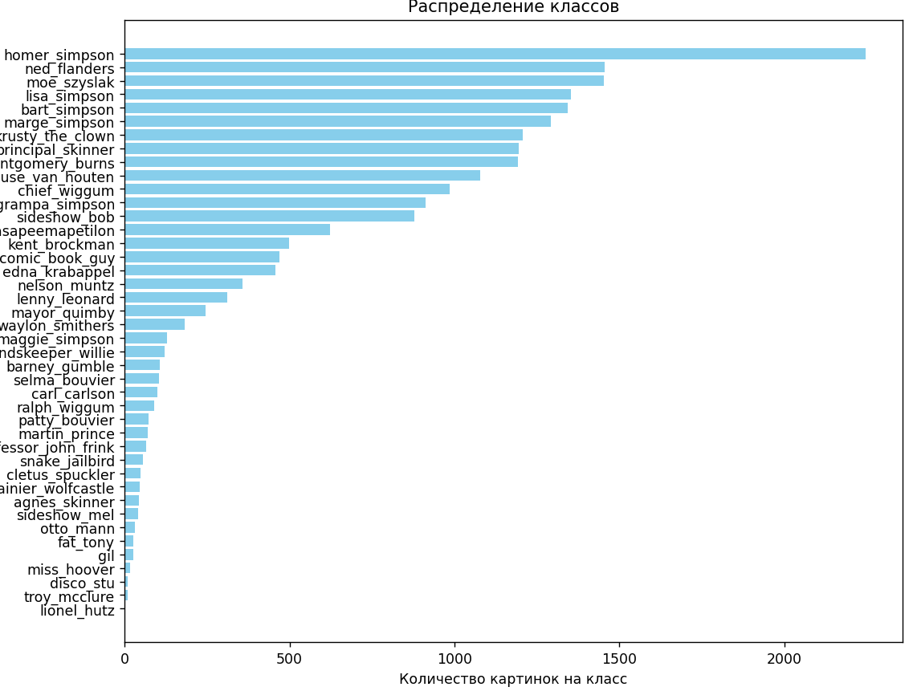
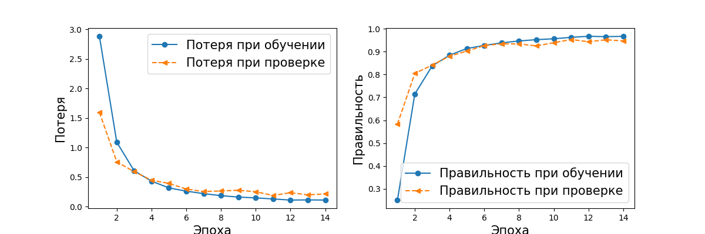
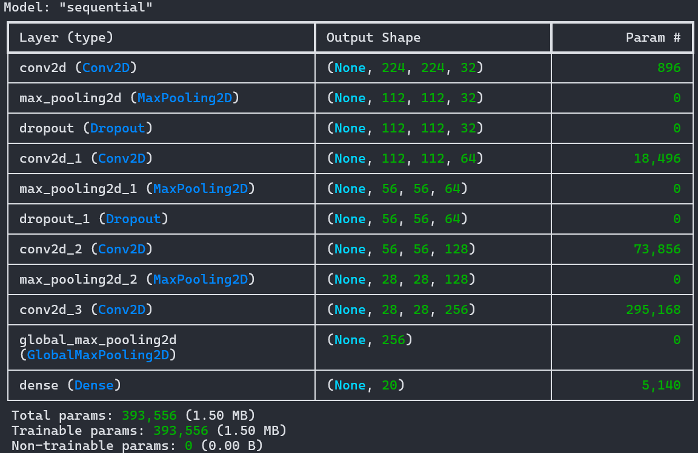
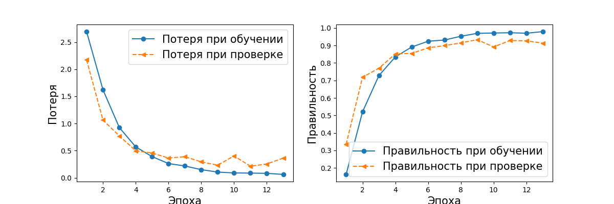
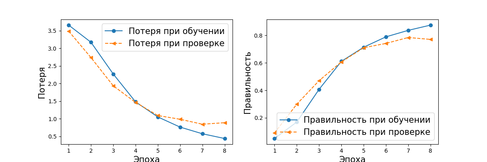
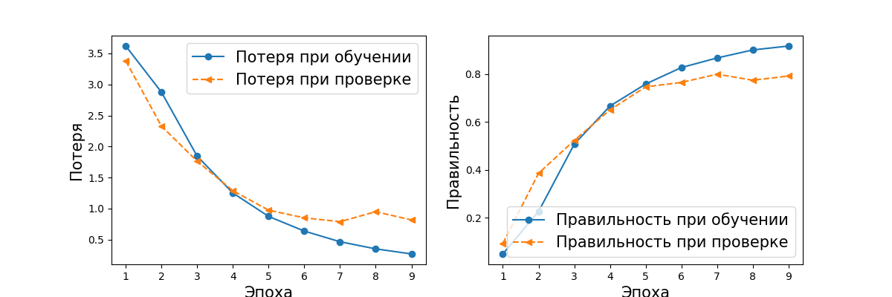
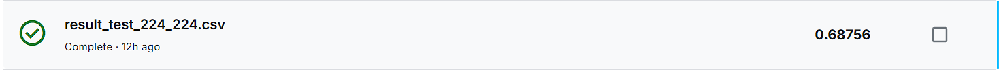
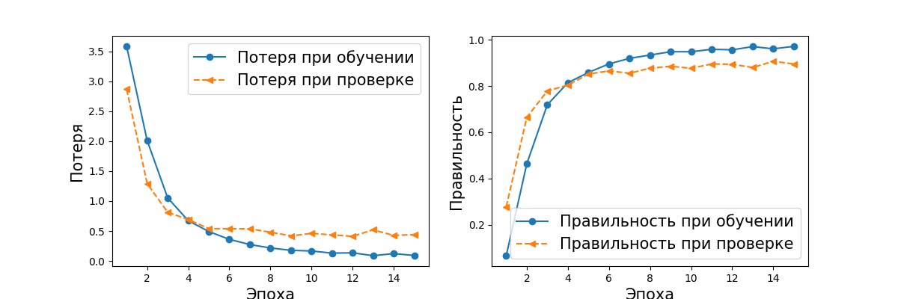
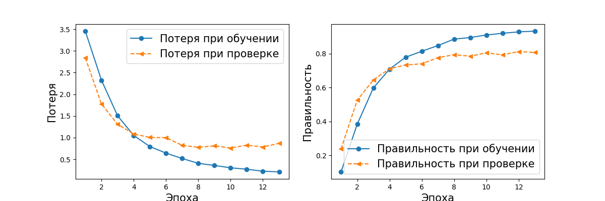

# Обучение сверточной сети на Tensorflow

## Задание

было взято на портале stepik от университета МИФИ, перенаправлено на Kaggle

ссылка на курс stepik: https://stepik.org/lesson/345648/step/1?unit=824917

ссылка на задание и датасет: https://www.kaggle.com/competitions/journey-springfield

**Цель**: обучить нейронную сеть различать 42-х жителей города

## Проблемы при решении задания

1. **Дисбаланс классов**. Буквально, в одном классе больше 1000 изображений, в другом 3

2. **Дисбаланс размеров изображений**. Средний размер изображений: 416/409. Максимальный размер изображения: 1072/1912

3. **Скорость обучения**. Обучать такой набор на ЦПУ отдельная проблема, решим (решено на Kaggle виртуальной машине)
4. **Нехватка памяти**. Нет доступа к Google Colab, 4 Гб видеопамяти маловато (решено на Kaggle виртуальной машине)

## Решение проблем (Реализация №2, Kaggle GPU)
1. **Проведение аугментации изображений**. Синтетически дополняем классы изображениями, если в классе изображений ниже порогового.
Используем методы tensorflow
2. **Ничего не отбрасываем, просто сжимаем до определенного размера**
3. **Создаем notebook на Kaggle**. Переключаем обучение с CPU на GPU. 30 часов в неделю на использование GPU на сервере 
4. **Меняем концепцию хранения тензоров**. Вместо отдельного сохранения каждого изображения в npy файл, аугментация и разбиение на батчи в реалтайме с помощью метода tensorflow.Datasets + 32 Гб оперативной памяти на виртуальной машине

## Результаты
1. Структура нейронной сети
Оставляем той же, что и при первой реализации, финальный слой на 42 класса
2. Обучение на 42 классах, 700 изображений на класс, батч = 64, точность 0.95, хорошая сходимость, есть точки переобучения

## Решение проблем (Реализация №1, локальный компьютер)

1. **Проведение аугментации изображений**. Синтетически дополняем классы изображениями, если в классе изображений ниже порогового.
Используем методы tensorflow
2. **Отбрасываем слишком большие или слишком малые изображения**.
3. **Ставим Linux консоль**. Скачиваем Ubuntu, для Nvidia скачиваем Cuda на Linux (поддержка tensorflow на Windows остановлена). Ощущаем прирост скорости обучения
4. **Даем tensorflow всю память видеокарты**. Скриптом снимаем ограничения на потребление видеопамяти. Для идеального эффекта обучения, нужно иметь 500 изображений на класс, в моем случае это было 155, больше просто не помещалось, точность 0.82

## Результаты

1. Структура нейронной сети
    
    
2. Обучение на 20 классах, 300 изображений на класс, батч = 20, точность/правильность обучения 0.92, после 8 эпохи переобучение

3. Обучение на 42 классах, 155 изображений на класс, батч = 10, точность 0.78, не хватает данных для обучения

4. Обучение на 42 классах, 155 изображений на класс, батч = 25, точность 0.8, не хватает данных для обучения

5. Обучение на 42 классах, 155 изображений на класс, батч = 25, точность 0.82, добавлен сверточный слой на 512, стабильно не хватает данных для обучения

Результат на Kaggle

6. Обучение на 42 классах, 500 изображений 128х128, до этого пункта были изображения 224х244, точность не улучшилась 

7. Попытка обучения на CPU, долго, но результат заметно лучше. Обучение на 42 классах, 300 изображений 224х224, батч = 20, точность 0.92

8. Добавление случайных поворотов при синтезировании недостающих изображений, 300 изображений 224х244, точность 0.80

Повороты не добавляем
### Итог: нужно минимум 500 изображений на класс
